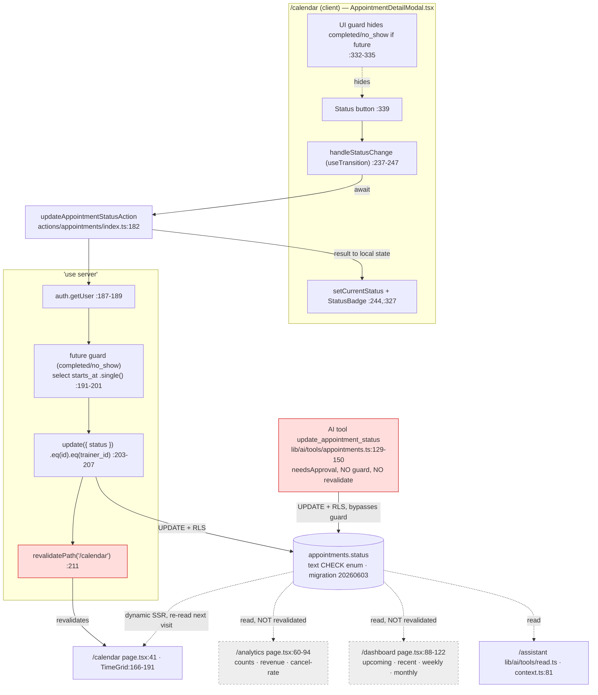

# Research: Appointment status write-path consistency

**Date**: 2026-07-03T21:38:54+02:00
**Researcher**: Claude Opus 4.8 (pair: Victoria)
**Git Commit**: fb83301b91fcac99efaa88da3a6d2b1adabc7332
**Branch**: chore/documentation-update
**Repository**: trainer-app

## Research Question

Analyze the appointment `status` write-path — the flow selected in `context/map/repo-map.md` as the hardest current coupling — with attention to the related areas the map defines. Three angles: (1) end-to-end trace with `file:line` + Mermaid, (2) test-coverage gaps by method and branch, (3) blast radius combining the static graph with git co-change. Describe present state only; separate evidence from inference from unknown; produce explicit **Feature overview** and **Technical debt** sections.

## Summary

The appointment `status` field has **two production write sites** and is read by **four** surfaces, and the two writers do not agree on the rules (write-site count ast-grep-verified — see "Structural claims verified" below; the earlier "three" counted test assertions, which don't write):

- **Canonical writer** — `updateAppointmentStatusAction` (`src/app/actions/appointments/index.ts:182`), called only from `AppointmentDetailModal.tsx`. It enforces a future-appointment guard (can't mark a future visit `completed`/`no_show`) and revalidates `/calendar`.
- **Divergent writer** — the AI tool `update_appointment_status` (`src/lib/ai/tools/appointments.ts:129-150`). It writes the same column with the same trainer-scoping and an approval gate (`needsApproval: true`), but **omits the future-date guard and calls no `revalidatePath`**. This is the single most important finding: the business rule is enforced on one write path and silently bypassed on the other.
- **Read surfaces** — `/calendar`, `/analytics`, `/dashboard`, and the AI assistant context all derive output from `status`. The status write revalidates **only `/calendar`**; `/analytics` and `/dashboard` are never revalidated. In practice this is currently harmless because all three pages render dynamically (per-request `cookies()`), so they re-query on next visit — but it is a latent bug the moment any page is made static/ISR.
- **Tests are RED right now.** `appointments.test.ts` fails 3 of 30 tests because the Supabase mock lacks `.single()`, which the guard calls (`index.ts:197`). The guard's happy path and its rejection branch therefore have **no passing coverage at any level**, and no E2E test crosses the calendar→analytics/dashboard boundary.
- **The status literal set is hand-duplicated across 8 sites**, one of which (`dashboard/page.tsx:54`) has already drifted (missing `scheduled`, different wording).

Verified live this session: `npx vitest run …/appointments.test.ts` → **3 failed | 27 passed**; the AI tool body at `lib/ai/tools/appointments.ts:136-149` has no guard.

---

## Feature overview

### What the feature does (EVIDENCE)

A trainer opens an appointment from the calendar and changes its lifecycle status. Status drives calendar styling, all analytics KPIs, dashboard tiles, package-slot depletion, double-booking overlap checks, and the AI assistant's answers.

- **Status enum** (canonical): `src/app/(app)/calendar/types.ts:3` — `type AppointmentStatus = 'scheduled' | 'completed' | 'cancelled' | 'no_show'`. Backed by a DB `text` column + `CHECK` constraint (`supabase/migrations/20260603000001_add_appointment_status.sql:1-4`), `NOT NULL DEFAULT 'scheduled'` — **not** a native Postgres enum.
- **UI entry**: `AppointmentDetailModal.tsx` renders one button per non-current status (`:330-346`), Polish labels from `STATUS_LABELS` (`:186-191`: "Odbyła się / Anulowana / Nieobecność / Zaplanowana"). For a future appointment it hides `completed`/`no_show` (`:332-335`, `isFuture = event.startsAt > new Date()`).
- **Write action**: `updateAppointmentStatusAction(id, status)` (`index.ts:182-213`) — auth check (`:187-189`), future guard for `completed`/`no_show` (`:191-201`), trainer-scoped `.update({ status }).eq('id').eq('trainer_id')` (`:203-207`), error branch (`:209`), `revalidatePath('/calendar')` (`:211`).

### End-to-end write trace (EVIDENCE, file:line)

1. Buttons rendered + UI guard hides `completed`/`no_show` for future appts — `AppointmentDetailModal.tsx:330-346`.
2. Tap → `onClick={() => handleStatusChange(s)}` — `AppointmentDetailModal.tsx:339` (disabled while pending, `:340`).
3. `handleStatusChange` clears error, runs inside `useTransition` — `AppointmentDetailModal.tsx:237-247`.
4. Server action invoked (`'use server'`) — `index.ts:182`.
5. Per-request Supabase client + auth — `index.ts:186-189` (`createClient` → `src/lib/supabase/server.ts:4-27`); no user → `{ error: 'Sesja wygasła' }`.
6. **Future-appointment guard** (only for `completed`/`no_show`): selects `starts_at` scoped to id+trainer via `.single()`, rejects if missing or future — `index.ts:191-201`, error `'Nie można oznaczyć przyszłej wizyty jako odbytej'`.
7. Trainer-scoped write `.update({ status }).eq('id', id).eq('trainer_id', user.id)` — `index.ts:203-207` (+ RLS `trainer owns appointments`, `initial_schema.sql:47-49`).
8. DB error branch → `'Nie udało się zaktualizować statusu'` — `index.ts:209`.
9. `revalidatePath('/calendar')`, return `{}` — `index.ts:211-212`.
10. Client: on error `setStatusError` (`:241-245`, shown `:347`); on success `setCurrentStatus` updates badge + re-filters buttons (`:244`, `StatusBadge` `:200-206/:327`).

### The three (four) read surfaces (EVIDENCE)

- **/calendar** — query selects `status` at `calendar/page.tsx:41`; per-package completed/scheduled counts `:57-64`; row map `:90`; grid styling `TimeGrid.tsx:166-191` (completed→green, cancelled→opacity+line-through, no_show→opacity). Overlap checks in the write action exclude cancelled/no_show (`index.ts:81-82`, `:136-137`).
- **/analytics** — `analytics/page.tsx:60-65` (period query on `status,price,…`) + `:69` all-time `.in('status',['completed','scheduled'])`; aggregates `:82-94` (completed/cancelled/no_show/scheduled counts, revenue from completed×price, cancellation rate); stat cards `:187-209`; day-of-week + top-clients count only `completed` (`:126-148`).
- **/dashboard** — `dashboard/page.tsx:88-122` (upcoming `.eq('status','scheduled')`, recent `.in('status',['completed','cancelled','no_show'])`, weekly `.eq('status','completed')`, monthly revenue `.eq('status','completed')`); render `:277-300`, tiles `:171/:179`.
- **/assistant (AI)** — `lib/ai/tools/read.ts:62,70,71,98,113,116` (status aggregates) and `lib/ai/context.ts:81` (LLM context string). A fourth status consumer not mentioned in the original map.

### Rendering & cache seam (EVIDENCE + INFERENCE)

- **EVIDENCE**: no `export const dynamic|revalidate|fetchCache|runtime` anywhere under `src/app`. Every page calls `await createClient()` → `await cookies()` (`server.ts:5`) + `supabase.auth.getUser()`. The only `revalidatePath` targets in the appointments action are `/calendar` (`index.ts:102,160,178,211`); the AI tool calls none.
- **INFERENCE**: reading `cookies()` per request opts all three pages into dynamic (per-request SSR) rendering, so the missing `/analytics` and `/dashboard` revalidation is currently *not* a visible bug — the next visit re-queries live data. It becomes a real staleness bug only if a page is later made static/ISR. This partially resolves unknown **U1** from the map: the mismatch is real but currently masked by dynamic rendering, not by design.

### Mermaid — write path + read fan-out

---

## Technical debt

Ranked by risk. Each item tagged EVIDENCE / INFERENCE and given a `file:line`.

### TD-1 — Two divergent write seams; the AI tool bypasses the guard (HIGH)
- **EVIDENCE**: `updateAppointmentStatusAction` enforces the future guard (`index.ts:191-201`); the AI tool `update_appointment_status` writes `.update({ status })` (`lib/ai/tools/appointments.ts:138-142`) with **no guard and no `revalidatePath`**. It has `needsApproval: true` (`:135`) so a human confirms, but confirmation does not validate the date. Re-declares the enum inline (`:133`) rather than importing `AppointmentStatus`.
- **INFERENCE**: a trainer can ask the assistant to mark a future appointment `completed`/`no_show`, approve it, and it will persist — inflating analytics "completed" counts and revenue with sessions that haven't happened. Any future fix to the guard applied only in the server action will silently not cover the AI path.

### TD-2 — Unit suite is RED; the guard has no passing test (HIGH)
- **EVIDENCE**: `npx vitest run src/app/actions/appointments/appointments.test.ts` → **3 failed | 27 passed** (verified this session). All 3 failures: `supabase.from(...).select(...).eq(...).eq(...).single is not a function` at `index.ts:197`. The mock `makeChain` (`appointments.test.ts:49`) lists `['select','insert','update','delete','eq','neq','lt','gt']` — **`single` is missing**. Failing tests: `calls update with new status and revalidates` (`:346-356`), `accepts no_show status` (`:383-389`), `silent no-op on 0 rows` (`:391-399`) — all use `completed`/`no_show`, which enter the guard.
- **INFERENCE**: the guard's two branches (blocks-future, passes-past) have zero passing coverage; the only branch actually covered for this action is auth-fail (`:358-365`). `scheduled`/`cancelled` pass only because they skip the guard, and neither asserts `revalidatePath`. Even adding `.single()` to the mock would not exercise the guard, because `setupSingleCallMock` (`:78-93`) returns one shared chain with a fixed resolve and no `starts_at` — the mock structurally cannot feed the guard a past-vs-future date.

### TD-3 — Revalidation under-scoped for the read fan-out (MEDIUM, latent)
- **EVIDENCE**: status writes revalidate only `/calendar` (`index.ts:211`; AI tool: none). `/analytics` and `/dashboard` read status but are never revalidated.
- **INFERENCE**: harmless today (dynamic rendering, see above), but it is a correctness landmine: making analytics/dashboard static or adding `revalidate` would immediately surface stale counts after a status change. The fix seam is `index.ts:211` plus the AI tool.

### TD-4 — Status literal set duplicated across 8 sites; one already drifted (MEDIUM)
- **EVIDENCE** — the same 4-value set is hand-maintained at: (1) `calendar/types.ts:3` union; (2) `migrations/20260603000001…sql:3` CHECK; (3) `index.ts:184` inline union param (does not import the type); (4) `lib/ai/tools/appointments.ts:133` zod enum; (5) `AppointmentDetailModal.tsx:330` button array; (6) `AppointmentDetailModal.tsx:186/:193` `Record<AppointmentStatus,…>` maps (compiler-checked); (7) `dashboard/page.tsx:54` `STATUS_LABELS`; (8) `lib/ai/tool-formatters.ts:1` `STATUS_LABELS`.
- **EVIDENCE of drift**: `dashboard/page.tsx:54` is a loosely-typed `Record<string,string>` with only 3 keys (missing `scheduled`) and different wording ("Ukończona"/"Odwołana") than the modal/formatter copies. Loosely-typed maps (dashboard + tool-formatters) won't fail compilation when a value is added.
- **INFERENCE**: adding a status value requires editing all 8 sites + a new migration; the loosely-typed maps are the copies most likely to be silently forgotten.

### TD-5 — E2E never crosses the status boundary (MEDIUM)
- **EVIDENCE**: `calendar.spec.ts` (single test, `:10-51`) creates then **deletes** an appointment — never sets a status. `analytics.spec.ts` (`:3-72`) asserts only headings, nav, period tabs, `?period=` URL, and "cards **or** empty state" (`:48-55`) — **no numeric assertion**. No test changes a status and asserts the analytics/dashboard number moves. Locators are role/label/text only (good); auth via `storageState: 'playwright/.auth/user.json'` (`playwright.config.ts:26-29`, `auth.setup.ts:8-23`); `fullyParallel: false`, `workers: 1`.
- **INFERENCE**: the exact risk that made this flow the map's target — "does a status change survive to analytics/dashboard?" — has no automated protection at any layer.

### TD-6 — Client optimism vs. silent no-op writes (LOW)
- **EVIDENCE**: `.update()` matching zero rows returns no error (`index.ts:203-209`); the client sets the new badge on any `{}` result (`AppointmentDetailModal.tsx:244`).
- **INFERENCE**: a status write that matched no row (RLS/ownership mismatch outside the guarded case) would still show success in the UI. Low practical risk given RLS + trainer scoping, but the UI trusts success it hasn't verified.

---

## Test coverage table (EVIDENCE)

`updateAppointmentStatusAction` (`index.ts:182-213`):

| Branch | Covered? | Where |
|--------|----------|-------|
| auth-fail (`:189`) | ✅ passes | `appointments.test.ts:358-365` |
| guard blocks future (`:198-200`) | ❌ none | error string never asserted anywhere |
| guard passes past → update | ❌ (test throws) | `:346-356` targets it but FAILS on `.single()` |
| DB-update error (`:209`) | ❌ none | no status test injects a write error |
| success + `revalidatePath` (`:211`) | ⚠ partial | `scheduled`/`cancelled` (`:367-373`,`:375-381`) skip guard; neither asserts revalidate; the one asserting revalidate uses `completed` and FAILS |

`createAppointmentAction` / `updateAppointmentAction` overlap-excludes-cancelled/no_show, and `deleteAppointmentAction`: **all covered and passing** (`appointments.test.ts:153-338`). The overlap tests assert the query is *built* with `.neq('status',…)` (`:212-213`, `:261-262`), not that the DB actually excludes rows (mock returns count regardless) — construction-level, not semantic.

---

## Blast radius — "must change together" (EVIDENCE + git co-change)

| Change kind | Files that must move together (`file:line`) | Git co-change proof |
|-------------|---------------------------------------------|---------------------|
| **Add a status value** | `calendar/types.ts:3` · new migration altering `appointments_status_check` (`…20260603…sql:3`) · `index.ts:184` · `lib/ai/tools/appointments.ts:133` · `AppointmentDetailModal.tsx:330,186,193` · `dashboard/page.tsx:54` · `lib/ai/tool-formatters.ts:1` · analytics/dashboard filters (`analytics:69`, `dashboard:93,101`) · `appointments.test.ts:349-388` | `0a786c6` — migration + type + action + schema + all calendar UI born in one commit |
| **Change the guard** | `index.ts:191-201` (server) · `AppointmentDetailModal.tsx:332-334` (UI mirror) · **gap:** `lib/ai/tools/appointments.ts:136-144` (no guard) · guard tests | **`f164aaa`** — guard added to `index.ts` **and** `AppointmentDetailModal.tsx` in the same commit ("hide buttons **and** add server-side guard") |
| **Change revalidation** | `index.ts:211` · add targets for `/analytics`, `/dashboard` · AI tool `appointments.ts:145` (adds none) | `f164aaa` shipped the analytics read surface but did not add its revalidation → the mismatch was born here |
| **Change DB schema** | new forward migration (DROP+ADD `appointments_status_check`) · then `types.ts:3`, `index.ts:184`, `appointments.ts:133`, all literal sites | `0a786c6` (schema+type+action co-located) |

Static-graph note: `updateAppointmentStatusAction` has exactly **one** production caller (`AppointmentDetailModal.tsx:6,240`); the AI tool is a parallel, non-importing writer. `git log` for `index.ts` is only 3 commits: `0a786c6` (birth), `965c0e5` (overlap-filter fix, co-changed with `appointments.test.ts`), `f164aaa` (guard).

---

## Structural claims verified (ast-grep + grep fallback)

Every structural assertion in this report (call-site counts, "only", "exactly one", method-list contents, duplication counts) was re-checked with `ast-grep` against the AST, not text. Per method, every **zero-match was re-run through classic `grep`** to distinguish a real absence from a bad pattern. `@ast-grep/cli` was installed only for this pass and removed afterward (no lasting dependency). Note: ast-grep JSON `range.start.line` is 0-indexed; the 1-indexed `file:line` below match the editor.

| # | Claim | Verdict | ast-grep pattern (lang) | Result |
|---|-------|---------|-------------------------|--------|
| C1 | status has 3 write sites | **REFINED → 2 production** | `$O.update({ status })` (ts) | `index.ts:205`, `lib/ai/tools/appointments.ts:140` only. Tests *assert* the call (`toHaveBeenCalledWith`), they don't write — the earlier "3" wrongly counted them. |
| C2 | `updateAppointmentStatusAction` has exactly 1 production caller | **CONFIRMED** | `updateAppointmentStatusAction($$$A)` (tsx+ts) | 1 production: `AppointmentDetailModal.tsx:240`; +6 test call-sites (`appointments.test.ts:349,361,370,378,386,394`). |
| C3 | status writes revalidate only `/calendar`; no `/analytics` or `/dashboard` anywhere | **CONFIRMED** | `revalidatePath($A)` (ts+tsx) | 10 total; appointments action = `index.ts:102,160,178,211`, all `'/calendar'`. Global targets are only `/packages`, `/clients`, `/calendar`. Zero `/analytics`\|`/dashboard`. |
| C4 | status literal set duplicated across 8 sites | **CONFIRMED (9 incl. STATUS_CLASSES)** | `type AppointmentStatus = $A`; `z.enum($A)` (ts) + grep for union/array/SQL | `types.ts:3` (union) · `index.ts:184` (inline union, exact copy) · `tools/appointments.ts:133` (zod) · `AppointmentDetailModal.tsx:330` (button array), `:186` (STATUS_LABELS), `:193` (STATUS_CLASSES) · `dashboard/page.tsx:54` · `tool-formatters.ts:1` · SQL `20260603000001…sql:4`. The 3 `Record<AppointmentStatus,…>` maps are compiler-checked (cheap); the SQL, zod, inline union, button array, and 2 loose `Record<string,string>` maps are not. |
| C5 | AI tool re-declares status via `z.enum` | **CONFIRMED** | `z.enum($A)` (ts) | `tools/appointments.ts:133` = `['scheduled','completed','cancelled','no_show']` (distinct from 2 unrelated `z.enum`s for duration/period). |
| C6 | `STATUS_LABELS` defined in 3 places | **CONFIRMED** | `const STATUS_LABELS = $A` → **0 (pattern fault)**; fixed `const STATUS_LABELS: $T = $A` | Initial pattern missed the type annotation → grep fallback found 3, fixed pattern matched all 3: `AppointmentDetailModal.tsx:186` (typed), `dashboard/page.tsx:54` + `tool-formatters.ts:1` (loose `Record<string,string>`). |
| C7 | mock `makeChain` omits `single` | **CONFIRMED** | grep (array literal) | `appointments.test.ts:49` = `['select','insert','update','delete','eq','neq','lt','gt']` — no `single`; guard calls `.single()` at `index.ts:197` → the 3 RED tests. |
| C8 | no `export const dynamic\|revalidate\|fetchCache\|runtime` under src/app | **CONFIRMED (real zero)** | `export const {dynamic,revalidate,fetchCache,runtime} = $A` (ts+tsx) | ast-grep 0 in all 4 × both langs; grep 0 confirmed. Dynamic rendering is therefore inferred from per-request `cookies()`, not declared. |
| C9 | action param re-declares union inline, does not import `AppointmentStatus` | **CONFIRMED** | grep (imports of `index.ts`) | `index.ts` imports (lines 3–7) exclude `AppointmentStatus`; the union at `:184` is a hand copy of `types.ts:3`. |

**Net effect on the report:** one factual correction (write sites 3 → 2, fixed in Summary); everything else confirmed with exact `file:line`. The only zero-match that was a pattern fault (C6) was caught by the mandated grep fallback and re-verified — a real absence (C8) was likewise grep-confirmed.

## Code References

- `src/app/actions/appointments/index.ts:182-213` — canonical status writer, guard, single `revalidatePath('/calendar')`
- `src/lib/ai/tools/appointments.ts:129-150` — **divergent** AI status writer (no guard, no revalidate)
- `src/app/(app)/calendar/AppointmentDetailModal.tsx:186-193,237-247,330-347` — UI entry, labels, guard mirror
- `src/app/(app)/calendar/types.ts:3` — `AppointmentStatus` union (source of truth)
- `src/app/(app)/analytics/page.tsx:60-94` — status → KPI aggregation
- `src/app/(app)/dashboard/page.tsx:54,88-122` — status filters + drifted `STATUS_LABELS`
- `src/lib/ai/tools/read.ts:62-116`, `src/lib/ai/context.ts:81` — AI read surface
- `supabase/migrations/20260603000001_add_appointment_status.sql:1-4` — text column + CHECK constraint
- `src/app/actions/appointments/appointments.test.ts:43-53,346-399` — mock missing `.single()`; guard tests fail
- `playwright/calendar.spec.ts:10-51`, `playwright/analytics.spec.ts:3-72` — E2E that never crosses the status boundary

## Architecture Insights

- **Defense-in-depth is the intended pattern** (UI hide + server guard, `f164aaa`) — but it was only applied to the human path, not the AI path. The two write seams are the core architectural debt.
- **Dynamic-by-default rendering** (per-request `cookies()`) is currently the safety net masking the revalidation mismatch. It is an implicit dependency, not a documented decision — fragile if someone optimizes a page to static.
- **`status` is a cross-cutting reporting primitive**, not just calendar state: it feeds four surfaces across three slices (S-04 calendar, S-07 analytics, S-08 dashboard) with no single owning module. This map + research is the only end-to-end description of that fan-out.
- The enum lives canonically in TS `types.ts` and DB CHECK, but the action, zod tool, and two label maps each re-declare it — single-source-of-truth is only partially enforced.

## Historical Context (from prior changes)

- `context/archive/2026-06-01-calendar-appointments/` (commit `0a786c6`) — origin of the `status` column, union type, action, and calendar UI, all in one commit.
- `context/archive/2026-06-25-trainer-analytics/plan.md` (commit `f164aaa`) — added the future-appointment guard (UI + server together) **and** the analytics read surface in the same change; this is where the guard-vs-AI divergence and the revalidation mismatch were introduced.
- `context/archive/2026-06-04-testing-appointment-action-baseline/` (commit `965c0e5`) — the action test baseline where `appointments.test.ts` and its Supabase mock were built (the mock predates the guard's `.single()` call, which explains the RED state).
- `context/archive/2026-06-04-ai-assistant/` — the AI tool surface (`lib/ai/tools/appointments.ts`); note its status tool was not reconciled with the later guard.

## Related Research

- `context/map/repo-map.md` — selection rationale + the four unknowns (U1-U4)
- `context/map/artifact-3-contributors.md` — the status write-path deep-dive that seeded this research
- `context/map/artifact-2-structure.md` — "Data-level coupling" section (status fan-out invisible to madge)

## Open Questions

- **U1 (partially resolved)**: analytics/dashboard staleness is masked by dynamic rendering today. Should revalidation still be corrected defensively so a future static optimization can't reintroduce the bug? (INFERENCE says yes; low cost.)
- **U2 (UNKNOWN)**: are `20260603000001_add_appointment_status.sql`, `20260605000001_pgvector.sql`, and `20260625000001_conversations.sql` actually applied to the live Supabase instance? Only the SQL files are in the repo — not determinable from code.
- **U3 (EVIDENCE, needs product decision)**: revenue counts only `completed` appointments with non-null `price` (`analytics/page.tsx:88`); unpriced completed sessions are excluded from revenue but counted as completed. Intended "N of M priced" display, or a data hole?
- **U4 (UNKNOWN)**: the guard blocks *setting* `completed`/`no_show` on a future appointment, but does editing an already-completed appointment's `starts_at` into the future re-validate? `updateAppointmentAction` (`index.ts:106-160`) was not confirmed to re-check status/date agreement — worth a targeted read.
- **New**: should the guard live in one shared helper imported by both the server action and the AI tool, to make TD-1 structurally impossible to reintroduce? (Design question for the plan phase.)
- **CI**: is `appointments.test.ts` run in CI (i.e. is the pipeline currently red)? Not inspected here.
